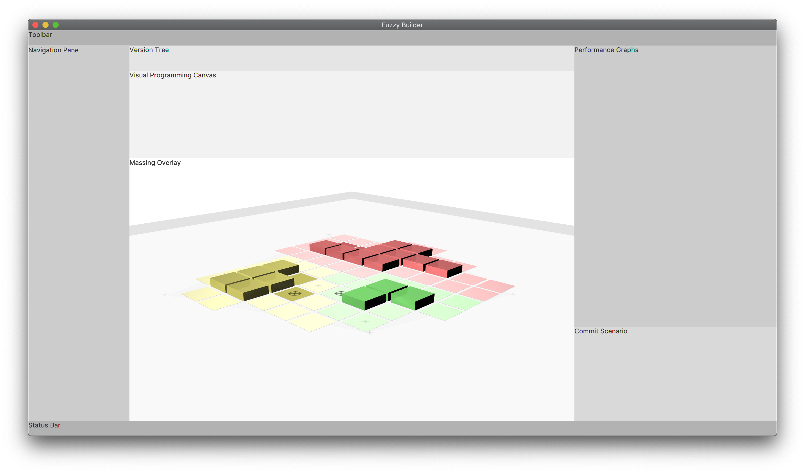

## Development: (v1.0-alpha.2+)
Ira Winder (jiw@mit.edu)

Current development of FuzzyBuilder is conducted using a more traditional workflow structured around Java projects located in the "Eclipse/" folder. Thusly, we recommend viewing and contributing using the Eclipse IDE.



## How to use the Eclipse IDE for files in /Eclipse

1. Download and install latest [Eclipse IDE for Java Developers](
https://www.eclipse.org/downloads/packages/release/2019-09/r/eclipse-ide-java-developers)

2. Download and install [Java SDK 13](https://www.oracle.com/technetwork/java/javase/downloads/jdk13-downloads-5672538.html)

3. Import each java project folder into Ecplise as its own java project:

	**fuzzybuilder-core/** These are the core "back end" components of Fuzzy Builder. The classes are purposely NOT DEPENDENT on any front-end GUI libraries such as processing or javafx.

	**fuzzybuilder-javafx/** This is the primary "front end" environment currently being developed. Its primary purpose is to initialize back end object models and allow a user to manipulate them. It should reference the "fuzzybuilder-core" project folder and you need to download and add the library for [javafx-sdk-13](https://gluonhq.com/products/javafx/).

	**fuzzybuilder-processing/** This is a bar bones GUI implemented using processing library components. Its primary purpose is to help demonstrate generalizability of the core backend components. Other than making sure it compiles, it's not intended for further feature development. It should reference the "fuzzybuilder-core" project folder and you need to download and add the library for [processing-3.5.3](https://processing.org/tutorials/eclipse/).

4. JavaFX Application Run Configuration: To compile and run the primary application being developed, you will need to set up a Run Configuration in Eclipse. The FuzzyBuilder.java file located in fuzzybuilder-javafx launches the JavaFX application.  In the "Run Configurations" menu set this as the main class:  'edu.mit.ira.fuzzy.fx.stage.FuzzyBuilder'. Under the "Arguments" tab, insert the following code into VM arguments: (Replace `/path/to/javafx-sdk-13` with the actual path to your JavaFX download. Also be sure to *uncheck* the box that says "Use the -XstartOnFirstThread argument when launching with SWT.)
```
--module-path "/path/to/javafx-sdk-13/lib" --add-modules javafx.controls,javafx.fxml,javafx.graphics,javafx.media,javafx.swing,javafx.web
```

3. Processing Application Run Configuration:The FuzzyBuilder.java file located in fuzzybuilder-processing launches a transitionary processing application that is no longer developed. No special arguments needed to run FuzzyBuilder.java, as long as you have pointed to processing's core.jar library in the project properties