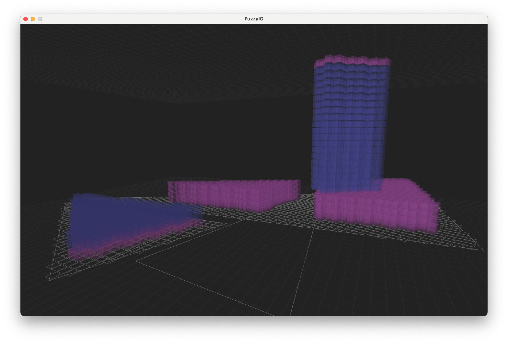

# FuzzyIO (v1.0 Processing Wireframe)

# Fuzzy Builder Prototype (v1.0-alpha.1)
Ira Winder (jiw@mit.edu)

NOTE! AS OF 2019.10.01, MOST OF THIS PROCESSING CODE IS DEPRECATED, AS IT IS BEING MIGRATED FROM PROCESSING TO ECLIPSE
Generally, Processing applications (such as FuzzyIO) are developed here with the intention of ultimately porting them to Eclipse.

Prototype demonstration of low-fidelity zone creation with Voronoi algorithm.

## Description
An alpha prototype of FuzzyBuilder was quickly developed in July 2019 using the Processing IDE at processing.org. Processing is a light-weight sketch coding environment based upon Java 8. This content is located in the "/Processing" folder, and includes a 'readme.txt' file that explains how to run the code on your own machine. This code is no longer updated, as development has moved into a more robust workflow based on native Java and JavaFX libraries. 

## How to open and run .PDE files (i.e. Processing scripts):

	1. Make sure you have installed the latest version of Java
	https://www.java.com/verify/

	2. Download Processing 3
	https://processing.org/download/

	3. Open and run "/FuzzyBuilder/FuzzyBuilder.pde" with Processing 3
