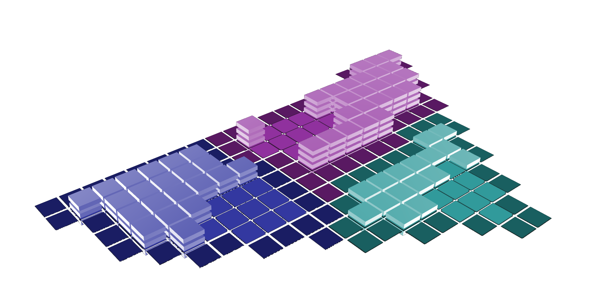

# Fuzzy Builder
Ira Winder (jiw@mit.edu)

FuzzyBuilder is an application for generating "fuzzy" resolution development scenarios on a configurable parcel, meant for a process somewhere between site acquisition and highly resolved scenario evaluation.

## Eclipse: (v1.0-alpha.2+)
More Recent Development iss conducted using a more traditional workflow structured around Java projects located in the "Eclipse/" folder. Thusly, we recommend reviewing and contributing using the Eclipse IDE. The "Eclipse/" folder contains a readme that explains how to set up your environment for each project.

## Processing: (v1.0-alpha.1)
An alpha prototype of FuzzyBuilder was quickly developed in July 2019 using the Processing IDE at processing.org. Processing is a light-weight sketch coding environment based upon Java 8. This content is located in the "Processing/" folder, and includes a readme file that explains how to run the code on your own machine. This code is no longer updated, as development has moved into a more robust workflow based on native Java and JavaFX libraries. 
